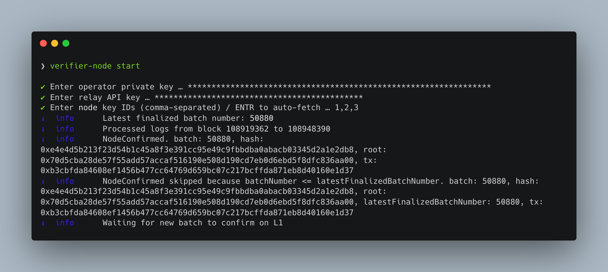
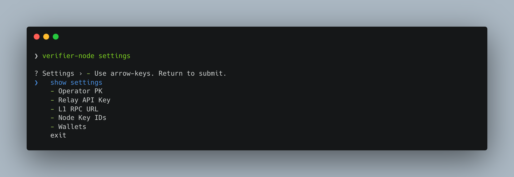

# Takibi Testnet Verifier Node

## Table of Contents

1. [Smart Contracts](#smart-contracts)
2. [Delegating the Node Key](#delegating-the-node-key)
3. [Getting a Gelato Relay API Key](#getting-a-gelato-relay-api-key)
4. [Installation](#installation)
5. [Running the node on a local machine](#running-the-node)
   - [Saving settings](#saving-settings)
6. [Running the node on a cloud provider](#running-the-node-on-a-cloud-provider)

## Smart contracts (Takibi Testnet)

| Smart Contract   | Address                                      |
| ---------------- | -------------------------------------------- |
| NodeKey          | `0xFB1F01aC08Ae256d2b0B1111406d145Cf80149c3` |
| NodeRewards      | `0xb4bF5CE7dEE0d63227156FE57f8D2e6f23886E9F` |
| Referee          | `0xEd570447B0034f430B0203BC29Aa3aE00321e312` |
| DelegateRegistry | `0x00000000000000447e69651d841bD8D104Bed493` |

## Delegating the Node Key

After aquiring a node key, delegate rights to an `Operator` to sign attestation transactions on your behalf. This ensures secure and efficient operation of your node.

- Navigate to [`DelegateRegistry.delegateERC721`](https://testnet.explorer.takibi.network/address/0x00000000000000447e69651d841bD8D104Bed493?tab=read_write_contract).
- Fill in the required parameters:
  - `to`: Operator address
  - `contract_`: `0xFB1F01aC08Ae256d2b0B1111406d145Cf80149c3` (NodeKey address)
  - `tokenId`: ID of node key NFT
  - `rights`: `0x0000000000000000000000000000000000000000000000000000000000000000`
  - `enable`: true
  - `send native USDC`: 0

## Getting a Gelato Relay API Key

The Gelato API Key is crucial for running the node as it allows the node to use Gelato Relay for transaction fees. This simplifies the process by enabling the use of various tokens (like USDC) to pay for gas fees.

To obtain the Gelato API Key:

1. Go to [Gelato Relay](https://app.gelato.network/relay).
2. Connect your wallet to create your account.
3. Click "Create App" and complete the basic details.
4. After creating the app, go to the details and copy the API key.
5. Deposit funds into your 1Balance.

## Installation

Go to the [Releases](https://github.com/gelatodigital/verifier-node-takibitestnet/releases) page and download the latest version of the verifier node application according to your machine.

For macOS:

- `takibi-testnet-verifier-node-${version}-x64.pkg`
- `takibi-testnet-verifier-node-${version}-arm64.pkg`

For Windows:

- `takibi-testnet-verifier-node-${version}-x64.exe`
- `takibi-testnet-verifier-node-${version}-x86.exe`
- `takibi-testnet-verifier-node-${version}-arm64.exe`

For Linux:

- `takibi-testnet-verifier-node-${version}-amd64.deb`
- `takibi-testnet-verifier-node-${version}-arm64.deb`
- `takibi-testnet-verifier-node-${version}-armel.deb`

After dowloading the file, install the application.

For macOS:

Right click the file and select `Open with` -> `Installer`.


For Windows:

Double click the file and follow the installation instructions.

<div style="display: flex; justify-content: space-between;">
    
    
</div>

## Running the node on a local machine

### Interactive CLI

Open up the command line interface of your machine.

For macOS:

1. Open Finder.
2. Navigate to Applications > Utilities.
3. Double-click Terminal.

For Windows:

1. Click the Start button.
2. In the search bar, type cmd or Command Prompt.
3. Select Command Prompt from the results.

Start the node by running the following command:

```
takibi-testnet-verifier-node start
```



The process will start and prompt you to enter

- Operator private key: The private key of the address which node keys are delegated to.
- Relay API key: The Gelato Relay API key (see [Getting a Gelato Relay API Key](#getting-a-gelato-relay-api-key)).
- Node key Ids: The IDs of the node keys that have been delegated to the operator.

### Saving settings

To save your settings and use them next time you start the node, run the following command:

```
takibi-testnet-verifier-node settings
```



The settings that are configurable are:

- Operator private key: The private key of the address which node keys are delegated to.
- Relay API key: The Gelato Relay API key (see [Getting a Gelato Relay API Key](#getting-a-gelato-relay-api-key)).
- L1 Rpc Url: Your personal RPC URL for the settlement chain, Arbitrum Sepolia. (Highly recommended to do set this)
- Node key Ids: The IDs of the node keys that have been delegated to the operator.
- Wallets: The wallets that will be filtered by if node key ids are automatically fetched.

## Running the node on a cloud provider

The verifier node is also available as a Docker image. Follow these steps to run it on a server, for example, on GCP:

1. Create a Cloud Run job pulling the `gelatodigital/verifier-node-takibitestnet` image.
2. Set up the environment variables.

```
   OPERATOR_PK=
   RELAY_API_KEY=
   # Set either one. 1 is for manually setting node key ids, 2 is for automatically fetching node key ids and optionally filtering by wallets.
   #------------1-------------
   NODE_KEY_IDS= # 1,2,3 (Comma seperated node key IDs)
   #------------2-------------
   AUTO_KEY_IDS=true
   WALLETS=
   # undefined (Use all fetched node key IDs delegated to operator) or
   # 0x...,0x,,, (comma seperated addresses) (Use fetched node key IDs that are delegated to operator and owned by defined wallets)
   #-------------------------
   # Optionals
   DEBUG= # true/false
   ONCE= # true/false (Set to true if you are running a job so that the job exits after running once)
   INTERVAL= # In ms (Must be > 60000)
   L1_RPC_URL=
   # Your personal RPC URL of settlement chain (Arbitrum Sepolia RPC)
   # Setting `L1_RPC_URL` is highly recommended for better reliability and performance
```

3. Add a scheduler trigger to execute the container every 10 minutes.
